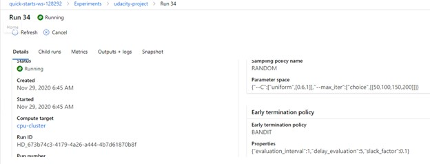

 # Optimizing an ML Pipeline in Azure

## Overview
This project is part of the Udacity Azure ML Nanodegree.
In this project, we build and optimize an Azure ML pipeline using the Python SDK and a provided Scikit-learn model.
This model is then compared to an Azure AutoML run.

## Summary
This dataset contains data about bank marketing. The details about each applicant is available along with historical transactional data. we seek to predict whether customer is eligible for loan or not. 
Model is trained based on logistics reignition and used hyper drive to tun parameters. This is also compared with Auto ML model.

**In 1-2 sentences, explain the solution: e.g. "The best performing model was a ..."**

## Scikit-learn Pipeline
**Explain the pipeline architecture, including data, hyperparameter tuning, and classification algorithm.**
The model aims at finding out if the applicant is eligible for loan or not, which is binary classification problem. SciKit lean classification algorithm, logistics regression is used to to arrive at the classification.

#### pipeline :  
Create a compute target with VM size of 'standard_D2_V2' with maximum four nodes

**What are the benefits of the parameter sampler you choose?**
Hyperparameters are adjustable parameters that let you control the model training process
Hyperparameter tuning is the process of finding the configuration of hyperparameters that results in the best performance.

The dictionary is passed as parameter ‘RandomparameterSampling’ containing each parameter and its distribution. The parameters in dictionary are learning rate, C and batch size. Parameter values are chosen from a set of discrete values or a distribution over a continuous range.

This code defines a search space with two parameters – learning_rate and keep_probability. 
Keep_probability has a uniform distribution with a minimum value of 0.6 and a maximum value of 1.
max_iter one of the values from the list of the values specified from 50,100,150, 200

**What are the benefits of the early stopping policy you chose?**
Early Termination Policy:  It makes sense if our script reports metrics periodically during the execution. 
We can detect that accuracy being achieved by a particular combination of hyperparameters is lower than median accuracy, and terminate the training early:

Bandit is an early termination policy based on slack factor/slack amount and evaluation interval. The policy early terminates any runs where the primary metric is not within the specified slack factor/slack amount with respect to the best performing training run.

The slack allowed with respect to the best performing training run. 
slack_factor specifies the allowable slack as a ration. 
A slackfactor of 0.1 is chosen since there is resource crunch in this case. 

### Image 

## AutoML
**In 1-2 sentences, describe the model and hyperparameters generated by AutoML.**

AUto ML selects ‘hyperparameters’ optimizes the values of hyper parameters automatically.
The hyperparameters generated by AUTOML for the experiment conducted are as shown below

Experiment: udacity-project,
Id: AutoML_44b90473-9062-4c89-8ffd-07ab7127adeb_34,
Type: None,
Status: Completed

learning_rate='constant',                                                                                    loss='modified_huber',
max_iter=1000,
n_jobs=1,
penalty='l2',
power_t=0.2222222222222222,
random_state=None,
tol=0.0001))],

EnsembleVoteClassifier is used 
The ‘EnsembleVoteClassifier’ is a meta-classifier for combining similar or conceptually different machine learning classifiers for classification via majority or plurality voting

## Pipeline comparison
**Compare the two models and their performance. What are the differences in accuracy? In architecture? If there was a difference, why do you think there was one?**

Between the two models, AutoML provided better accuracy. Best run model from Auto ML provided accuracy 0.9174810318664643. For AutoML Classfication task is selected with primary metric as 'Accuracy' with five cross validations. Auto ML checks for class imbalance, missing value imputation, high cardinality. It has reached early stopping criteria at 36th run.

Auto ML checks various algorithm, optimizes hyperparameters, uses various feature engineering techniques and  uses early stopping to arrive at best model with best accuracy.

Since it uses various ensembles and do feature engineering , Auto ML arrives at better accuracy.
I realize that Azure ML simplifies the process of model tuning, comparing to doing it manually using SK Lean and hyperdrive to optimize hyperparameters.

## Future work
**What are some areas of improvement for future experiments? Why might these improvements help the model?**
We can do feature engineering and feature selection techniques.
We can look at EDA analysis to understand the labels if they are distributed properly or skewed in any direction.
We can utilizer more powerful compute cluster and try more runs with various parameter combinations.
We can also deep learning techniques and leverage neural networks.

## Proof of cluster clean up

